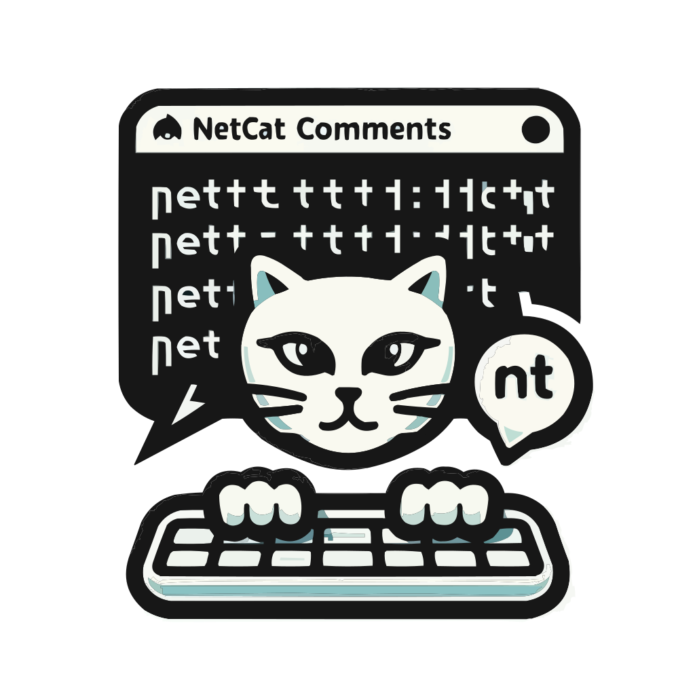

# Netcat Comments

## 🏗️Setup

1. Clone repository and install dependencies

```bash
$ git clone https://github.com/ndom91/netcat-comments.git
$ cd netcat-comments
$ corepack enable
$ pnpm install
```

2. Run development server

```bash
$ pnpm dev
```

You'll then have a process listening on port `5000`

3. Start Netcat on port `5000`

```bash
$ nc localhost 5000
```

In this netcat process you can then send and receive messages by entering your message and pressing <kbd>Enter</kbd>.

## 👷 Usage

Messages sent to the system have the following syntax.

```
<requestId>|<command>|<payload>
```

- `requestId` - Unique 7 character string matching `/([a-z]{7})/`
- `command` - One of the available [commands](#%EF%B8%8F-commands)
- `payload` - Command specific payload. If there are multiple fields, these will continue to be pipe (`|`) delimited.

Example:

```bash
> nc localhost 5000
abcdefg|SIGN_IN|nico
abcdefg

gfedcba|WHOAMI
gfedcba|nico
```

## ⚙️ Commands

### `SIGN_IN` 

Signin with a supplied username as 

**Payload Arguments**
- `<username>`

**Returns**
- `<requestId>` - Request Id consisting of a 7-character lowercase string

---

### `SIGN_OUT` 
Signout of supplied username 

**Payload Arguments**
- `<username>`

**Returns**
- `<requestId>` - Request Id consisting of a 7-character lowercase string

---

### `WHOAMI` 

Return current username

**Payload Arguments**
- None

**Returns**
- Active `username`

---

### `CREATE_DISCUSSION` 

Create a comment thread

**Payload Arguments**
- `<discussionUserReference>` - Discussion user reference consisting of a period delimited alphanumeric string, such as `b3hsbdf.1m30s`
- `<comment>` - Comment body, a unicode string of unspecified length

**Returns**
- `<discussionId>` - Discussion thread identifier

---

### `GET_DISCUSSION`

**Payload Arguments**
- `<discussionId>` - Discussion Id consisting of a 7-character alphanumeric string, like `dh7hs3b`

**Returns**
- `<requestId>` - Request Id consisting of a 7-character lowercase string
- `<discussionId>` - Discussion Id consisting of a 7-character alphanumeric string, like `dh7hs3b`
- `<discussionUserReference>` - Discussion user reference consisting of a period delimited alphanumeric string, such as `b3hsbdf.1m30s`
- `(<username>|<comment>)[]` - Array of all messages with `username` and `comment`

---

### `CREATE_REPLY`

**Payload Arguments**
- `<discussionId>` - Discussion Id consisting of a 7-character alphanumeric string, like `dh7hs3b`
- `<comment>` - Comment body

**Returns**
- `<requestId>` - Request Id consisting of a 7-character lowercase string

---

### `LIST_DISCUSSIONS`

**Payload Arguments**
- `<commentReferencePrefix>` - First part of the period delimited reference, such as `b3hsbdf`

**Returns**
- `<requestId>` - Request Id consisting of a 7-character lowercase string
- `<discussionId>` - Discussion Id consisting of a 7-character alphanumeric string, like `dh7hs3b`
- `<discussionUserReference>` - Discussion user reference consisting of a period delimited alphanumeric string, such as `b3hsbdf.1m30s`
- `(<username>|<comment>)[]` - Array of all messages with `username` and `comment`

## 📝 License

MIT
